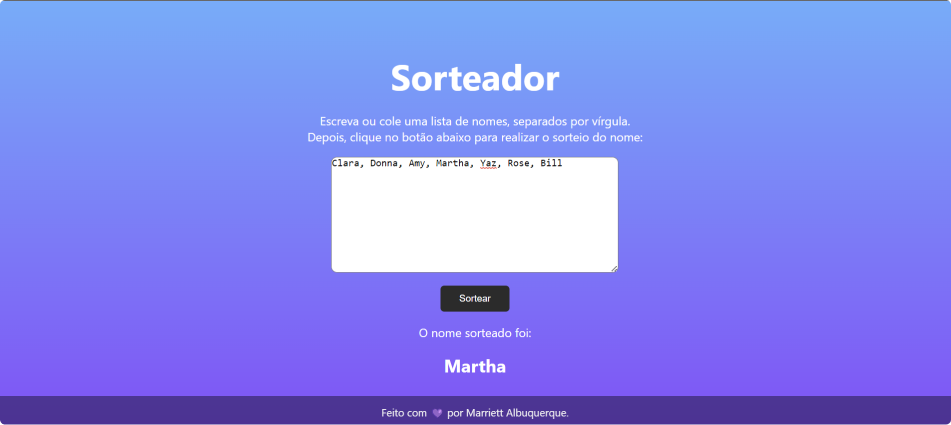

# APP SORTEADOR

  

## 🖥 Projeto

- Esse é um aplicativo web que pode ser utilizado para fazer sorteio em uma lista.

### 👩‍💻 Como utilizar
* Adicione uma lista (nomes, números etc.) no campo texto
* Cada item deve __obrigatoriamente__ ser separado por `,` (uma vírgual)
* Clique no botão e o sorteio será realizado
* __ATENÇÃO__: a aplicação não guarda os dados de cada sorteio.
* A cada execução do botão para sortear, a aplicação irá criar uma nova lista (array vazio) para incluir os nomes atualmente informados no campo de texto.

### 🚀 Tecnologias
- Esse projeto foi desenvolvido utilizando as seguintes teconologias:
  - HTML
  - CSS
  - JavaScript
  - Git e Github

### 🏷 Execução

Você pode utilizar esse projeto de forma imediata e gratuita clicando [neste link](https://marriett.github.io/sorteador/).

